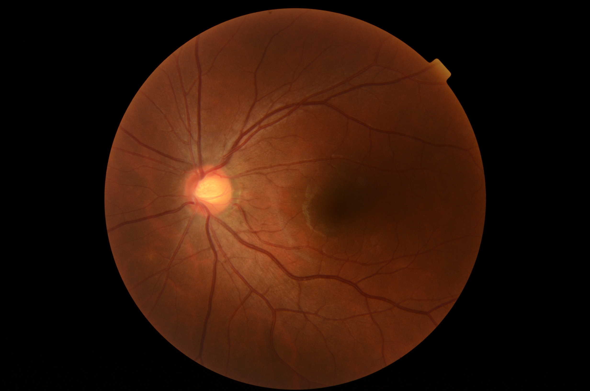
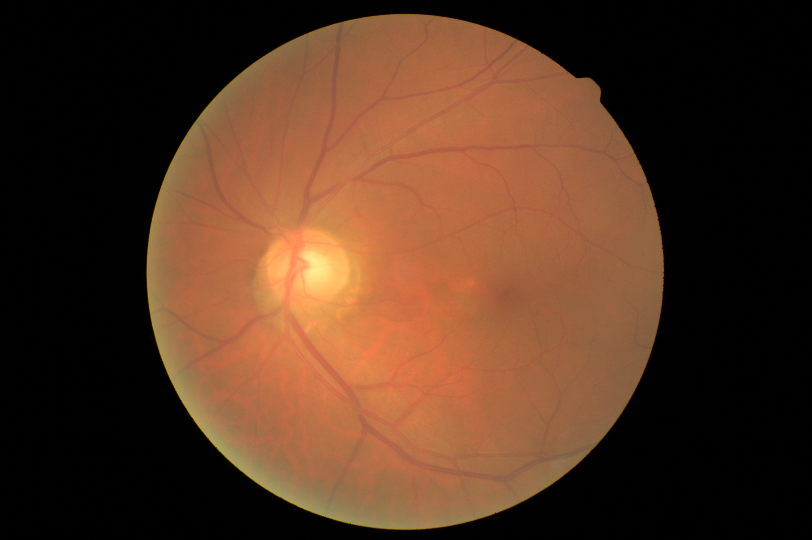
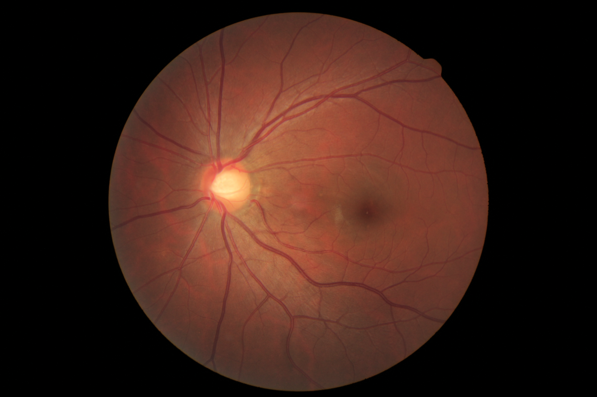

# Retina Dataset

Retina dataset containing four categories: 1) normal 2) cataract 3) glaucoma 4) retina disease.

## Samples

### retina_dataset/dataset/1_normal/

### retina_dataset/dataset/2_cataract/

### retina_dataset/dataset/2_glaucoma/

### retina_dataset/dataset/3_retina_disease/

